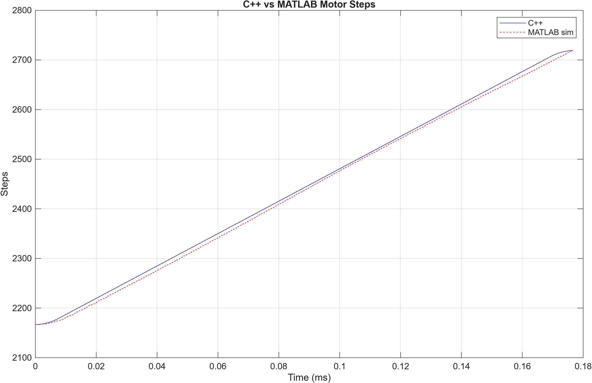
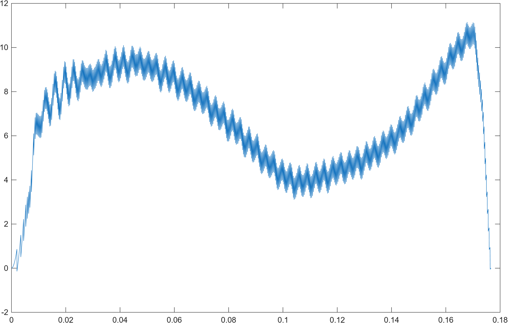

# C++ Motor Step Simulator

A C++ simulation of a stepper motor moving from a current position to a target position using trapezoidal motion control. The simulator models velocity constraints, acceleration and deceleration behavior, bidirectional movement, overshoot detection, and trajectory logging. Results are exported to a CSV file and validated against a MATLAB control algorithm simulation.

---

## Validation Results

The simulator output was validated against a MATLAB control algorithm simulation across a matched motion profile.

### Position Output: C++ vs MATLAB


### Error Analysis


Maximum positional deviation was **< 0.5%** across the full motion profile. Remaining error is attributed to discretization between integer step accumulation in C++ and continuous-time integration in MATLAB.

---

## Overview

Real motors cannot instantly move from one position to another. Whether controlling a robotic arm, CNC machine, or automated positioning system, motion must obey acceleration limits, velocity constraints, and stopping requirements.

This project simulates that behavior using a trapezoidal motion planning approach commonly found in robotics and embedded motor control systems. The simulator computes position and velocity at fixed time intervals and generates a complete trajectory from the starting position to the target position.

---

## Features

- User-defined current position, target position, maximum RPM, and acceleration
- Bidirectional motion (positive and negative movement)
- Trapezoidal motion profile with acceleration and deceleration phases
- Velocity limiting based on motor RPM
- Automatic deceleration using physics-based stopping distance calculation (v²/2a)
- Overshoot detection
- Time-stepped simulation
- Position, velocity, and time logging
- CSV export for plotting and analysis
- Validated against MATLAB control algorithm results

---

## Motion Model

The simulator performs the following steps during each simulation update:

1. Calculate the remaining distance to the target position.
2. Calculate the stopping distance based on the current velocity.
3. Accelerate if sufficient distance remains.
4. Decelerate when approaching the target.
5. Update velocity and position.
6. Store simulation data for export.

Stopping distance is computed using:

```
d = v² / (2a)
```

where:

- `d` = stopping distance (steps)
- `v` = current velocity (steps/sec)
- `a` = acceleration (steps/sec²)

This ensures the motor begins decelerating at the correct point to arrive smoothly at the target position.

---

## Repository Structure

```
cpp-motor-step-simulator/
├── main.cpp
├── README.md
├── .gitignore
├── plots/
│    ├── cpp_vs_matlab_steps.png
│    └── error_plot.png
├── matlab/
│    └── compare_plots.m
└── sample_output/
     ├── motor_data.csv
     └── matlab_sim_output.csv
```

- `main.cpp` — C++ trapezoidal motion simulator
- `compare_plots.m` — MATLAB script to compare C++ and MATLAB outputs and plot error
- `motor_data.csv` — logged output from the C++ simulator
- `matlab_sim_output.csv` — exported MATLAB simulation data used for validation
- `plots/` — validation figures exported from MATLAB

---

## Example Run

### Input

```
Current position (steps): 0
Target position (steps): 5000
Max RPM: 30
Acceleration (steps/sec^2): 100
```

### Console Output

```
0.01 sec : 0.01 steps | velocity = 1 steps/s
0.02 sec : 0.03 steps | velocity = 2 steps/s
0.03 sec : 0.06 steps | velocity = 3 steps/s
0.04 sec : 0.10 steps | velocity = 4 steps/s
...
```

### Final Summary

```
Simulation Complete

Total Time: 12.34 sec
Final Position: 5000 steps
Overshoot: No
```

---

## CSV Output

Simulation data is exported to `motor_data.csv`:

```csv
Time,Position_steps,Velocity_steps_per_sec
0,0,0
0.01,0.01,1
0.02,0.03,2
...
```

The MATLAB comparison data is stored in `matlab_sim_output.csv` with the same format, allowing direct overlay and error analysis using `compare_plots.m`.

---

## Building and Running

### Compile

```bash
g++ main.cpp -o simulator
```

### Run

Linux/macOS:
```bash
./simulator
```

Windows:
```bash
simulator.exe
```

---

## Running the MATLAB Validation

Open `matlab/compare_plots.m` in MATLAB and run it. It reads both CSV files and produces:

1. A side-by-side position comparison plot (C++ vs MATLAB)
2. A position error plot over time

Requires MATLAB with no additional toolboxes.

---

## Technologies Used

- C++ / STL (`vector`, `fstream`, `cmath`)
- Numerical simulation and time-stepped integration
- Trapezoidal motion planning
- Physics-based stopping distance calculation
- CSV data logging
- MATLAB for validation and visualization

---

## Applications

This project demonstrates concepts used in:

- Robotics and robotic arm trajectory planning
- Motion control systems
- Industrial automation and CNC machines
- Embedded motor control software
- Stepper motor and encoder-based positioning systems

---

## Future Improvements

- S-curve motion profiles for jerk-limited motion
- Multi-joint robotic arm simulation
- Real-time graphical visualization
- Multiple motor coordination
- PID position control loop
- GUI-based interface
- Integration with robotic arm kinematics

---

## Author

Developed as a robotics and software engineering project to explore motion simulation, trajectory generation, and motor control concepts using C++.

---

## License

This project is licensed under the MIT License. See the LICENSE file for details.